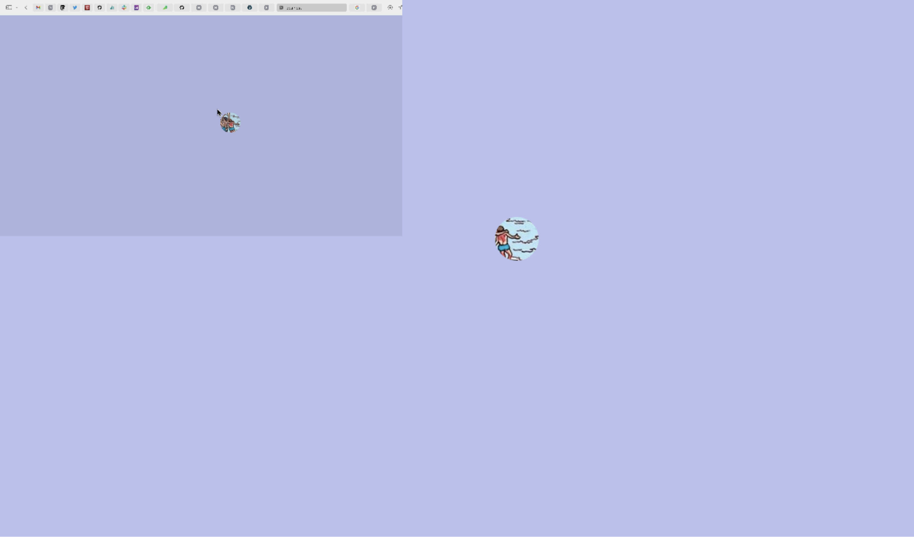

# Find Waldo!

## Game Play
---

Your goal is finding waldos🔍 in 5 minutes⏱️!

1. If you think you find the waldo in the screen, click it🖱️ and lock it.
2. Click🖱️ the circle again to expose the whole horizontal line of screen.
3. Click🖱️ the line again to expose the whole vertical line of screen.
4. Click🖱️ the line again to expose the whole image.
5. Look at🧐 the drawing for a while to appreciate the art. (you only have 5 minutes to find all of them!
6. Click🖱️ to go on to another map.

## Knowledge behind that game
---

### Why we only reveal the circle🔍 not the whole map?

- Cause we want it to be harder!
- Cause we don't want others to win if we should where waldo is on the map!

For the second point, our circle is actually invovling zero-knowledge proof!

## Zero-knowledge proof
---

Zero-knowledge proof is a cryptography term that means we can show we know something without actually revealing some meaningful knowledge.

Just like we circle out only Waldo with a mask on other parts of the map, but not pointing out where he is on the map with the whole map is revealed.

We are basically showing we have done something without actually showing we have done something!

> Another example can be: You are doing the Math test. You are not actually reciting and writing down the literal contents of Trigonometric functions, but solving questions of Trigonometric functions. You are showing the professor you know them without giving out the actual contents of Trigonometric functions, because in probability, if you answer those questions all right, you can be verified that you know about Trigonometric functions. You are using zero-knowledge proof!

## Why zero-knowledge proof matter?
---

### Privacy matters.

Zero-knowledge proof can be used for identity verification, privacy protection, and of course blockchain technology. You cam prove you are the owner of the account, without revealing any personal information.

You can rely on Math, not the privacy policy by Google, Facebook, or Amazon.

## Development path

At first, I want to build a far more complicated app. At the very end of development, I write about 500 lines of code. And I think it will be a better idea to add some interaction on the mouse. So I added a little circle beside the mouse to make it like a little mouse pet.

And then I realize I can actually build a Find Waldo game on the basis of the mouse pet, and share some interesting stuff about zero-knowledge proof!

And I just rewrite all of the code, to build this, little Find Waldo game.

Hope you enjoy the game, and the little piece of knowledge!